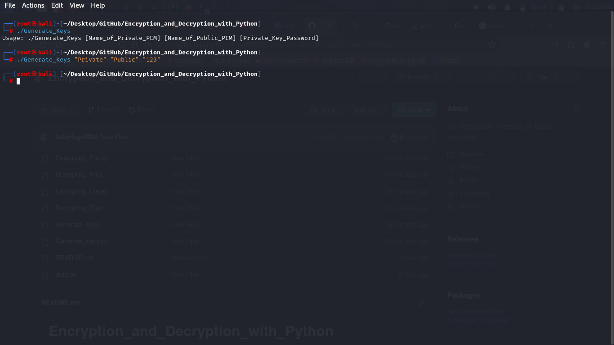

# Encryption and Decryption with Python  

---

This project contains tools for encrypting and decrypting files using the RSA encryption technique. This project is also
a skill showcase.  

This project is based on the [Encryption with Python][link1] guided project. However, all the codes and files present
in this project were created, debugged, and tested by the owner of this repository.  

### How does it work?  

For the encryption process using RSA, two keys are generated. The *private key*, used for decrypting files, and a
*public key*, used for encrypting files. After the keys are generated, they are *serialized*. The process of
**serialization** revolves around the idea of transforming a program memory object into a hard disk memory file, which
can be handled in many ways, shared, and stored for later use.  

After the process of serializing the keys, the file is encrypted. First, the file-to-be-encrypted is loaded into the
program memory, as well as the *public key*. The file is encrypted using the *public key*. The ciphertext generated
by the encryption method is stored as a file, using the same extension of the original one. The decryption follows the
same process but uses the *private key*.  

### For the tools' functionality, you can click here: [Tools][tools]  

### For the project's showcase, you can click here: [Showcase][showcase]  

---

## How to use  

To get access to the tools contained in this repository, you can either download the source code for each tool or you
can clone this repository by running the following command:  

> `git clone https://github.com/ItaloHugoMDS/Encryption_and_Decryption_with_Python.git`  

The tools used in this project can only encrypt small files due to the limitations of RSA. But before jumping to the
file encryption process, a few steps need to be taken first:  

1. Generating the keys;  
2. Encrypting the file;  
3. Decrypting the file.  

For each step in further detail, you can go to the **Syntax** of the tools.

## Syntax  

### 1. Generating the keys  

In order to generate the keys for encryption and decryption, you can use the [`Generate_Keys.py`][file1] file, which
will require `python3` to be run, and execute the following command:  

> `python3 Generate_Keys.py [Name_of_Private_PEM] [Name_of_Public_PEM] [Private_Key_Password]`  

Otherwise, you can use the [`Generate_Keys`][file2] file, which can be stored in to the `/bin` directory and script can
be run anywhere within the terminal, and use the following command:  

> `./Generate_Keys [Name_of_Private_PEM] [Name_of_Public_PEM] [Private_Key_Password]`  

The arguments for both files are the same:  

- **\[Name_of_Private_PEM\]:** This will be the **private** key's PEM file name.  
- **\[Name_of_Public_PEM\]:** This will be **public** key's PEM file name.  
- **\[Private_Key_Password\]:** This will be the password used for the serialization of the **private** key.  

### 2. Encrypting Files  

For the encryption process, you can use the [`Encrypt_File.py`][file3] which will require `python3`, and run the
following command:  

> `python3 Encrypt_File.py [File_Name] [Public_Key.pem] [Encrypted_File_Name]`  

You can also use the [`Encrypt_File`][file4] file, and execute the following command:  

> `./Encrypt_File [File_Name] [Public_Key.pem] [Encrypted_File_Name]`  

Both files make use of the same argument:  

- **\[File_Name\]:** The name of the file to be encrypted.  
- **\[Public_Key.pem\]:** The serialized public key PEM file.  
- **\[Encrypted_File_Name\]:** This is an **optional** argument, this will be the name of the encrypted output file. If
this argument isn't provided in the execution, the original file will be overwritten with the encrypted content.  

### 3. Decrypting Files  

The decryption process can be done using the [`Decrypt_File.py`][file5], executing the following command:  

> `python3 Decrypt_File.py [File_To_Be_Decrypted] [Private_Key.pem] [Private_Key_Password] [Encrypted_File_Name]`  

It is also possible to use the [`Decrypt_File`][file6], using the following command:  

> `./Decrypt_File [File_To_Be_Decrypted] [Private_Key.pem] [Private_Key_Password] [Encrypted_File_Name]`  

The arguments used for both files are the same:  

- **[File_To_Be_Decrypted]:** The file that will be decrypted.  
- **[Private_Key.pem]:** The serialized private key PEM file.  
- **[Private_Key_Password]:** Here will come the password used on the private key serialization process.  
- **[Encrypted_File_Name]:** This is an **optional** argument, this will be the name of the decrypted output file. If
this argument isn't provided in the execution, the original file will be overwritten with the decrypted content.  

---  

## Showcase  

For this showcase, a simple file containing some basic content, which can be seen under the [data.txt][file7] file, was
used as data for encryption.  

The first step was generating the keys.  

Script's arguments:  

> [][image1]  

Executing the command:  

> [][image2]  

Script's output:  

> [][image3]  

The next step is to encrypt the data file.  

Original data:  

> [][image4]  

Script's arguments:  

> [][image5]  

Script's execution and output:  

> [][image6]  

The final step is to decrypt the encrypted file.  

Encrypted file:  

> [][image7]  

Script's argument:  

> [][image8]  

Script's execution and output:  

> [][image9]  

The Encryption and Decryption scripts also except extra arguments, those arguments are used for generating a different
output file instead of overwriting the original one. Here is one use of the extra arguments:  

Original data:  

> [][image10]  

Script execution and output into new file:  

> [][image11]  

Decrypting the file.  

Encrypted data:  

> [][image12]  

Script execution and output:  

> [][image13]  

[link1]: https://www.coursera.org/projects/encryption-with-python-encrypt-data-with-key-pairs "Coursera Guided Project"
[tools]: https://github.com/ItaloHugoMDS/Encryption_and_Decryption_with_Python#how-to-use
[showcase]: https://github.com/ItaloHugoMDS/Encryption_and_Decryption_with_Python#showcase
[file1]: https://github.com/ItaloHugoMDS/Encryption_and_Decryption_with_Python/blob/main/Generate_Keys.py "Generate Keys Python3"
[file2]: https://github.com/ItaloHugoMDS/Encryption_and_Decryption_with_Python/blob/main/Generate_Keys "Generate Keys"
[file3]: https://github.com/ItaloHugoMDS/Encryption_and_Decryption_with_Python/blob/main/Encrypt_File.py "Encrypt File Python3"
[file4]: https://github.com/ItaloHugoMDS/Encryption_and_Decryption_with_Python/blob/main/Encrypt_File "Encrypt File"
[file5]: https://github.com/ItaloHugoMDS/Encryption_and_Decryption_with_Python/blob/main/Decrypt_File.py "Decrypt File Python3"
[file6]: https://github.com/ItaloHugoMDS/Encryption_and_Decryption_with_Python/blob/main/Decrypt_File "Decrypt File"
[file7]: https://github.com/ItaloHugoMDS/Encryption_and_Decryption_with_Python/blob/main/data.txt "Data File"
[image1]: https://github.com/ItaloHugoMDS/Encryption_and_Decryption_with_Python/blob/main/images/Generate_Keys_1.png
[image2]: https://github.com/ItaloHugoMDS/Encryption_and_Decryption_with_Python/blob/main/images/Generate_Keys_2.png
[image3]: https://github.com/ItaloHugoMDS/Encryption_and_Decryption_with_Python/blob/main/images/Generate_Keys_3.png
[image4]: https://github.com/ItaloHugoMDS/Encryption_and_Decryption_with_Python/blob/main/images/Encrypt_File_1.png
[image5]: https://github.com/ItaloHugoMDS/Encryption_and_Decryption_with_Python/blob/main/images/Encrypt_File_2.png
[image6]: https://github.com/ItaloHugoMDS/Encryption_and_Decryption_with_Python/blob/main/images/Encrypt_File_3.png
[image7]: https://github.com/ItaloHugoMDS/Encryption_and_Decryption_with_Python/blob/main/images/Decrypt_File_1.png
[image8]: https://github.com/ItaloHugoMDS/Encryption_and_Decryption_with_Python/blob/main/images/Decrypt_File_2.png
[image9]: https://github.com/ItaloHugoMDS/Encryption_and_Decryption_with_Python/blob/main/images/Decrypt_File_3.png
[image10]: https://github.com/ItaloHugoMDS/Encryption_and_Decryption_with_Python/blob/main/images/Encrypt_File_NewName_1.png
[image11]: https://github.com/ItaloHugoMDS/Encryption_and_Decryption_with_Python/blob/main/images/Encrypt_File_NewName_2.png
[image12]: https://github.com/ItaloHugoMDS/Encryption_and_Decryption_with_Python/blob/main/images/Decrypt_File_NewName_1.png
[image13]: https://github.com/ItaloHugoMDS/Encryption_and_Decryption_with_Python/blob/main/images/Decrypt_File_NewName_2.png
